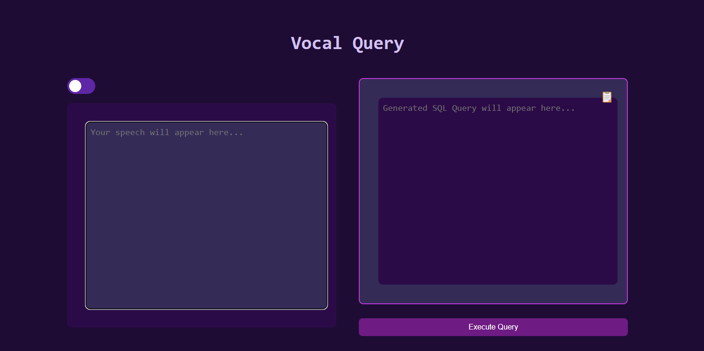
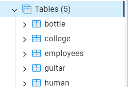

### VOCAL QUERY

This application provides an API for transcribing audio and converting spoken commands into SQL queries using Google APIs and a generative AI model. It first transcribes real time audio submitted by users via Google’s Speech-to-Text API. Then, using the transcribed text, it generates a SQL query in PostgreSQL syntax with the help of the Google Gemini AI model. The generated query is cleaned, executed in a PostgreSQL database. 

